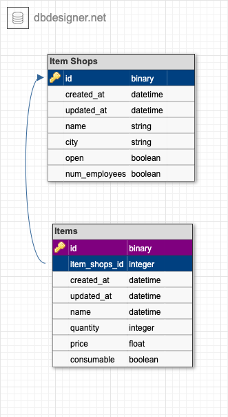

# Realtional Rails


 <!-- ALL-CONTRIBUTORS-BADGE:START - Do not remove or modify this section -->
[](#contributors-)
<!-- ALL-CONTRIBUTORS-BADGE:END -->


## Background and Description

Relational Rails is a backend application to represent a one to many relationship. The data exposed is a representation of a database with the use of ActiveRecord and allowing users to utilize CRUD Functionality.

## Schema

## Learning Goals

- Design a one to many relationship using a schema designer
- Write migrations to create tables with columns of varying data types and foreign keys.
- Use Rails to create web pages that allow users to CRUD resources
- Create instance and class methods on a Rails model that use ActiveRecord methods and helpers
- Write model and feature tests that fully cover data logic and user behavior
- Utilize quality workflow practices: small commits, descriptive pull requests, and code reviews
- Write thorough, understandable documentation
- Refactor code for better code organization/readability


## Requirements and Setup (for Mac):

### Ruby and Rails
- Ruby Version 2.7.4
- Rails Version 5.2.7

### Gems Utilized
- RSpec
- Pry
- Capybara
- Launchy
- Orderly
- SimpleCov
- Shoulda-Matchers

## Setup
1. Clone this repository:
On your local machine open a terminal session and enter the following commands for SSH or HTTPS to clone the repositiory.


- using ssh key <br>
```shell
$ git clone git@github.com:ShermanA-13/relational_rails.git
```

- using https <br>
```shell
$ git clone https://github.com/ShermanA-13/relational_rails.git
```

Once cloned, you'll have a new local copy in the directory you ran the clone command in.

2. Change to the project directory:<br>
In terminal, use `$cd` to navigate to the backend Application project directory.

```shell
$ cd relational_rails
```

3. Install required Gems utilizing Bundler: <br>
In terminal, use Bundler to install any missing Gems. If Bundler is not installed, first run the following command.

```shell
$ gem install bundler
```

If Bundler is already installed or after it has been installed, run the following command.

```shell
$ bundle install
```

There should be be verbose text diplayed of the installation process that looks similar to below. (this is not an actual copy of what will be output).

```shell
$ bundle install
Fetching gem metadata from https://rubygems.org/...........
Fetching gem metadata from https://rubygems.org/.
Resolving dependencies...
Using rake 13.0.6
Using concurrent-ruby 1.1.10
Using i18n 1.10.0
Using minitest 5.15.0
Using thread_safe 0.3.6
Using tzinfo 1.2.9
Using activesupport 5.2.7
Using builder 3.2.4
Using erubi 1.10.0
Using mini_portile2 2.8.0
Using racc 1.6.0
Using nokogiri 1.13.3 (arm64-darwin)
Using rails-dom-testing 2.0.3
Using crass 1.0.6
Using loofah 2.15.0
Using rails-html-sanitizer 1.4.2
Using actionview 5.2.7
Using rack 2.2.3
Using rack-test 1.1.0
Using actionpack 5.2.7
Using nio4r 2.5.8
Using websocket-extensions 0.1.5
Using websocket-driver 0.7.5
Using actioncable 5.2.7
Using globalid 1.0.0
Using activejob 5.2.7
Using mini_mime 1.1.2
Using mail 2.7.1
Using actionmailer 5.2.7
Using activemodel 5.2.7
Using arel 9.0.0
Using activerecord 5.2.7
Using marcel 1.0.2
Using activestorage 5.2.7
Using public_suffix 4.0.6
Using addressable 2.8.0
Using bindex 0.8.1
Using msgpack 1.4.5
Using bootsnap 1.11.1
Using bundler 2.1.4
Using matrix 0.4.2
Using regexp_parser 2.2.1
Using xpath 3.2.0
Using capybara 3.36.0
Using coderay 1.1.3
Using coffee-script-source 1.12.2
Using execjs 2.8.1
Using coffee-script 2.4.1
Using method_source 1.0.0
Using thor 1.2.1
Using railties 5.2.7
Using coffee-rails 4.2.2
Using diff-lcs 1.5.0
Using docile 1.4.0
Using ffi 1.15.5
Using jbuilder 2.11.5
Using launchy 2.5.0
Using rb-fsevent 0.11.1
Using rb-inotify 0.10.1
Using ruby_dep 1.5.0
Using listen 3.1.5
Using rspec-support 3.11.0
Using rspec-core 3.11.0
Using rspec-expectations 3.11.0
Using rspec-mocks 3.11.0
Using rspec 3.11.0
Using orderly 0.1.1
Using pg 1.3.4
Using pry 0.14.1
Using puma 3.12.6
Using sprockets 3.7.2
Using sprockets-rails 3.4.2
Using rails 5.2.7
Using rspec-rails 5.1.1
Using sass-listen 4.0.0
Using sass 3.7.4
Using tilt 2.0.10
Using sass-rails 5.1.0
Using shoulda-matchers 3.1.3
Using simplecov-html 0.12.3
Using simplecov_json_formatter 0.1.4
Using simplecov 0.21.2
Using uglifier 4.2.0
Using web-console 3.7.0
```

If there are any errors, verify that bundler, Rails, and your ruby environment are correctly setup.

4. Database Migration<br>
Before using the web application you will need to setup your databases locally by running the following command

```shell
$ rails db:{:drop,:create,:migrate,:seed}
```


5. Startup and Access<br>
Finally, in order to use the web app you will have to start the server locally and access the app through a web browser.
- Start server

```shell
$ rails s
```

- Open web browser and visit link
    http://localhost:3000

At this point you should be taken an index page with clickable links to different data sets with the ability to create, read, update, and delete data.

## Endpoints provided


## **Contributors ✨**

Thanks go to these wonderful people ([emoji key](https://allcontributors.org/docs/en/emoji-key)):

<!-- ALL-CONTRIBUTORS-LIST:START - Do not remove or modify this section -->
<!-- prettier-ignore-start -->
<!-- markdownlint-disable -->
<table>

  <tr>

   <td align="center"><a href="https://github.com/ShermanA-13"><br /><sub><b>Sherman (he/him)</b></sub></a><br /><a href="" title="Code">💻</a> <a href="" title="Ideas, Planning, & Feedback">�</a> <a href="" title="Tests">⚠️</a> <a href="" title="Reviewed Pull Requests">👀</a></td>

  </tr>
</table>

<!-- markdownlint-restore -->
<!-- prettier-ignore-end -->

<!-- ALL-CONTRIBUTORS-LIST:END -->

This project follows the [all-contributors](https://github.com/all-contributors/all-contributors) specification.
<!--


git remote add origin git@github.com:ShermanA-13/realational_rails.git
git branch -M main
git push -u origin main